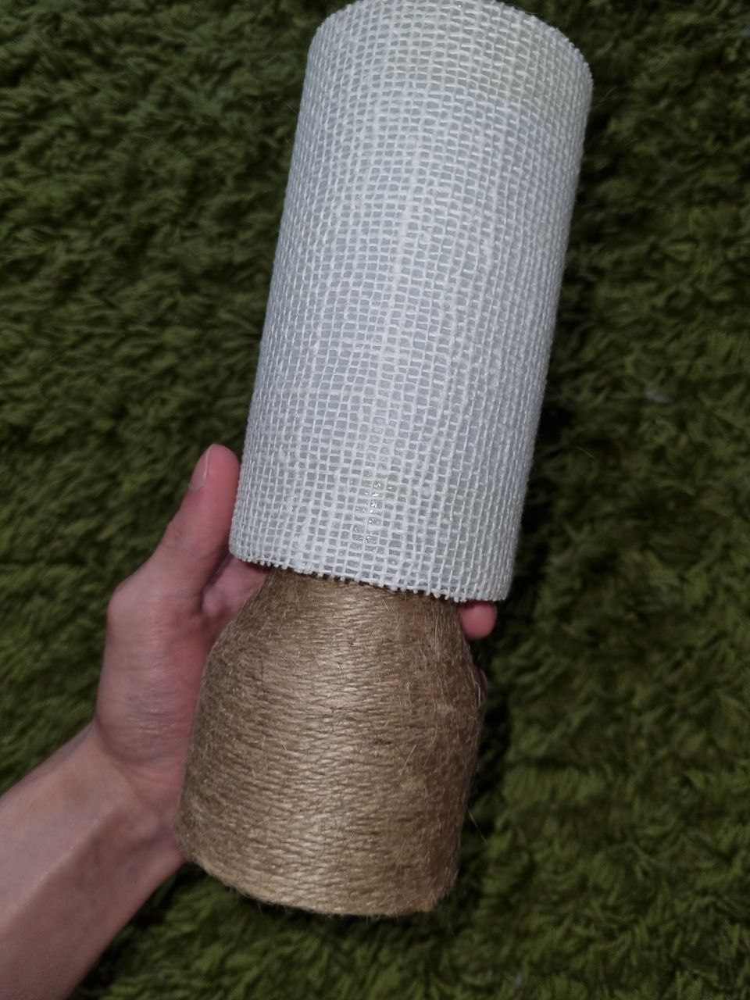

# "Безконтактная" лампа

## Описание проекта
Этот проект представляет собой лампу с возможностью управления движениями, основанной на плате Arduino Nano, использующие датчик расстояния, светодиодную ленту и блок питания для работы самой лампы. Управление устройством осуществляется с помощью жестов, которые считывает датчик движения. Корпус для устройства был сделан из сантеха, для оформления были использованы подручные средства. 

## USER Case
Лампа работает по принципу достал, подключил, заработало. 
Функции:
* 1 взмах - включение/выключение
* 2 взмаха - переключение режимов (RGB, огонёк, белый свет с 
настройкой теплоты)
* 1 взмах и удержание - режим смены цветов/теплоты (в 
зависимости от режима)
* удержание - регулировка яркост

## Компоненты проекта
* _project.ino_ - Основной файл прошивки, содержащий логику программы.
* _readme.md_ - Небольшой файл с описанием проекта.

## Аппаратные компоненты 
* Адаптер питания сетевой Live-Power 5V LP27 5V/3A
* Ультразвуковой датчик расстояния HC-SR04 5V
* Cветодиодная лента WS2812b Eco 
* Плата Arduino Nano

## Итоговый вид

